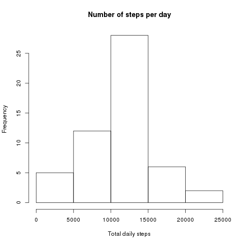
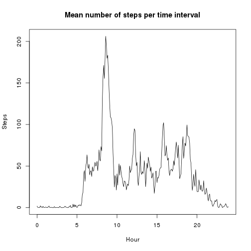
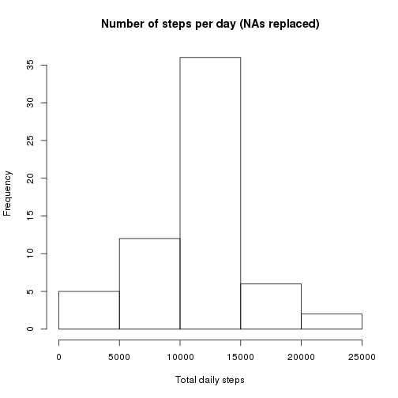
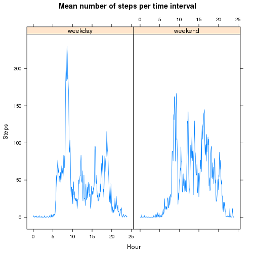

Reproducible Research: Peer Assessment 1
========================================


## Loading and preprocessing the data

Table is loaded and a new column with the time interval in minutes is created.


```r
data <- read.csv('activity.csv')
data$date <- as.Date(data$date, format="%F")
x <- sprintf("%04d", data$interval)
data$minute <- as.numeric(substr(x, 1, 2)) * 60 + as.numeric(substr(x, 3, 4))
```


## What is mean total number of steps taken per day?


```r
daily <- aggregate(steps ~ date, data=data, FUN=sum)
hist(daily$steps, main='Number of steps per day', xlab='Total daily steps')
```



Mean total steps per day: 1.0766189 &times; 10<sup>4</sup>  
Median total steps per day: 10765


## What is the average daily activity pattern?


```r
activity <- aggregate(steps ~ minute, data=data, FUN=mean)
plot(activity$minute/60, activity$steps, type='l',
     main='Mean number of steps per time interval', xlab='Hour', ylab='Steps')
```



Hour of maximum number of steps:
8.5833333


## Inputing missing values

Missing values are replaced by the mean number of steps for each time interval.
The mean and the median daily total number of steps did not change after
filling in the missing values. 

Total NAs: 2304


```r
library(plyr)

data2 <- join(data, activity, by='minute')
colnames(data2) <- c('steps', 'date', 'interval', 'minute', 'mean_steps')

data2$steps <- replace(data2$steps, is.na(data2$steps), data2$mean_steps)
data2 <- subset(data2, select=-mean_steps)

daily2 <- aggregate(steps ~ date, data=data2, FUN=sum)
hist(daily2$steps, main='Number of steps per day (NAs replaced)',
     xlab='Total daily steps')
```



Mean total steps per day: 1.0766189 &times; 10<sup>4</sup>  
Median total steps per day: 1.0766189 &times; 10<sup>4</sup>


## Are there differences in activity patterns between weekdays and weekends?

There is a clear peak on the number of steps ~ 08:30 AM on weekdays, probably
when people are going to work. On weekends, however steps appear to be more
distributed throughout the day.


```r
library(lattice)

data2$wday <- NA

wdays <- weekdays(data2$date)
wend <- wdays == "domingo" | wdays == "sábado"
data2$wday[wend] <- 'weekend'
data2$wday[!wend] <- 'weekday'
data2$wday <- as.factor(data2$wday)

activity2 <- aggregate(steps ~ minute + wday, data=data2, FUN=mean)

xyplot(steps ~ minute / 60 | wday, data=activity2, type='l',
       main='Mean number of steps per time interval', xlab='Hour', ylab='Steps')
```


